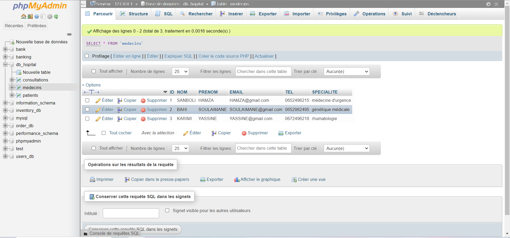
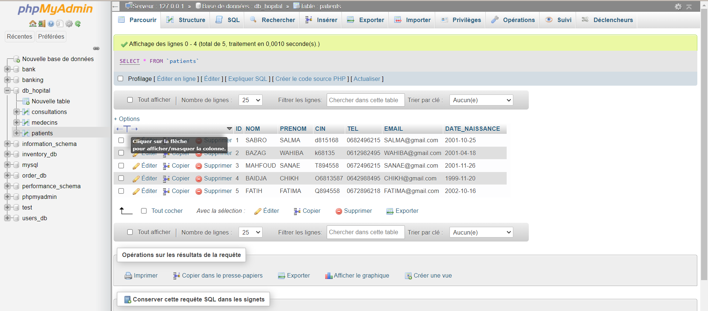
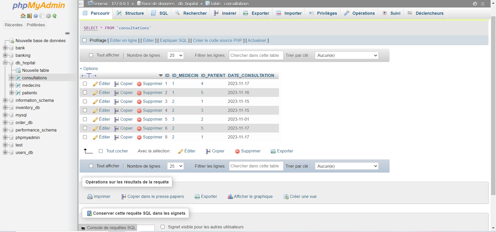
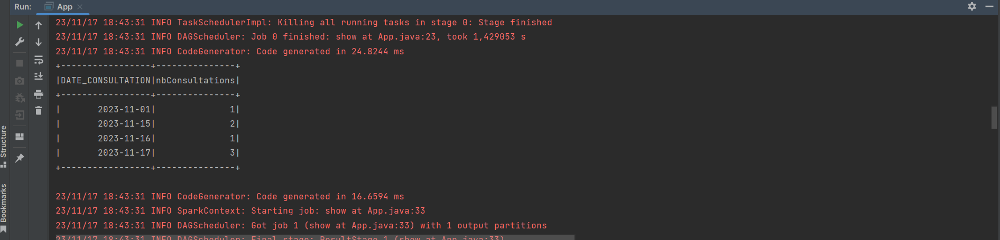
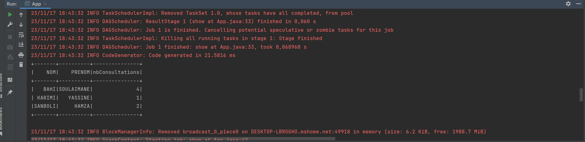
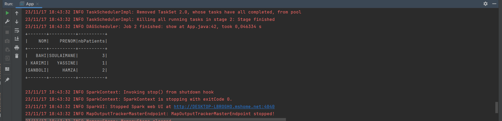

<H1  style="text-align:center"> SPARK SQL HEALTH </H1>
<H2>- My SQL DATA BASE</H2>
<H3>-  Doctors Table</H3>

<H3>-  Patients Table</H3>

<H3>-  Consultations Table</H3>

<h2>- Processing Stored Data In Mysql</h2>
<H3>- Number Of Consultations Per Day</H3>

<H3>- Number Of Consultations Per Doctor </H3>

<H3>- For Each Doctor The Number Of Patients He Has Attended</H3>

